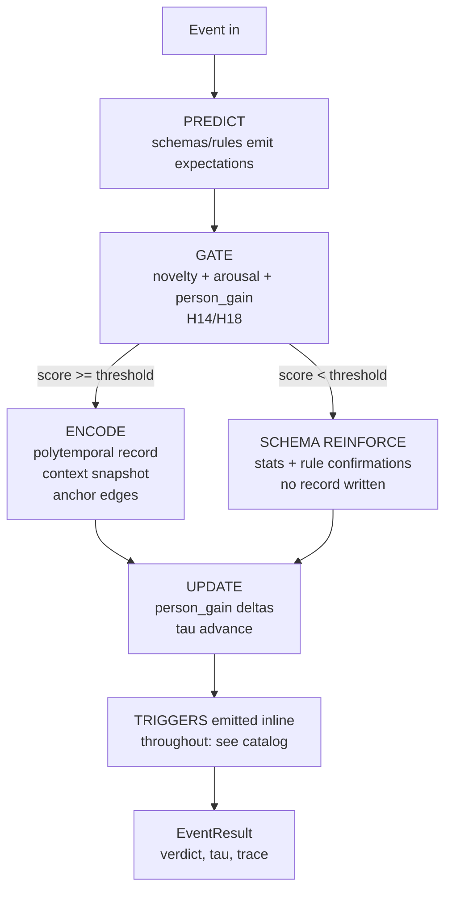

# MemoryEngine — Foundation Design

> v0 storage: **SQLite** behind a `Store` protocol (zero-ops, test-friendly).
> PG+pgvector adapter arrives with embeddings; mechanisms never see SQL.

## Pipeline flow (`new_event`)



`observe(event)` = identical pipeline with `store=False` — the gate still runs,
schema still reinforces, rules still confirm, but no episode row is ever
written. Use for counterfactual gate testing and historical warm-up sweeps.

`prune(tau_now)` = H15 ladder pass: aged episodes merge into day-tokens →
week-tokens → schema references; flashbulb tier exempt; tombstone residues
(usage counts, anchor edges) always survive the body.

## Trigger catalog (emitted inline during processing)

| trigger | fired when |
|---|---|
| `prediction_made` | schemas/rules emit expectations for the incoming context |
| `prediction_violation` | observed feature contradicts expectation — also raises gate score |
| `gate_decision` | every event; verdict + full feature vector |
| `episode_encoded` | gated write committed |
| `schema_reinforced` | below-gate reinforcement applied |
| `anchor_detected` | episode promoted to anchor (threshold or override) |
| `escalation_burst` | arousal above burst threshold — capture window widens (H16) |
| `rule_confirmed` / `rule_violated` | predicted outcome matched/contradicted (H17) |
| `rule_proposed` | consolidator diff found recurring antecedents |
| `person_gain_updated` | miss-cost or honor event moved a weight (H18) |
| `tier_promoted` | deferred significance evidence crossed threshold (H16) |

Handlers are registered per-call (`handlers={type: fn}`) and invoked **inline**
at emission — so mid-event state changes (e.g., escalation widening capture)
are possible. Every trigger is also appended to `result.trace` regardless of
handlers, giving the after-each-message review surface.

## Gate scoring v0 (transparent placeholders — tuned during corpus walks)

```
novelty  = 1 - best_prediction_match          # H14 surprise
gain     = person_weight[pid]                  # H18, learned from miss-costs
arousal  = f(feature salience proxies)         # H16 input
score    = w_n*novelty + w_a*arousal + w_g*gain
encode   ⇔ score ≥ threshold OR arousal ≥ burst_threshold
```

All weights live in engine config; the point is *visibility*, not correctness
— corpus walks tune them against human judgment.

## τ accounting

Per-stream proper time (`stream_tau`), advanced only by surprise-weighted
events (H14: uneventful ≈ zero). Cross-stream comparison deferred to
activation-currency layer (T2 decision) — documented open problem.
